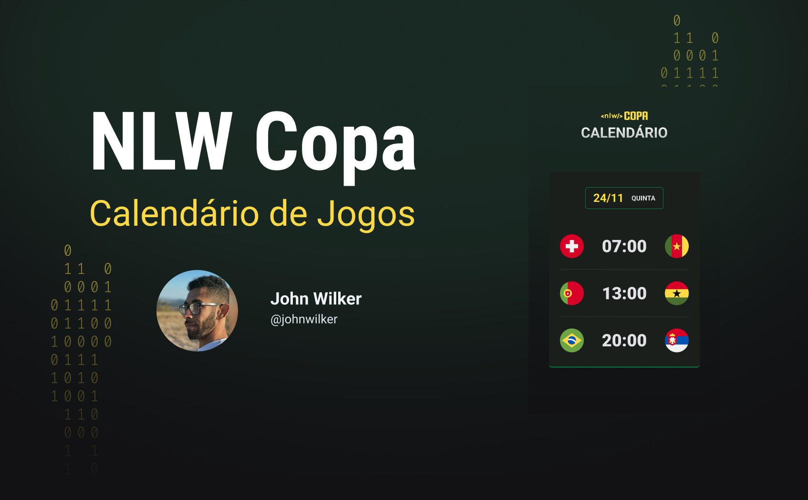

<h1 align="center"> NLW Copa Calendário de Jogos </h1>

Aplicação desenvolvida em evento promovido pela Rocketseat para ensino de tecnologias WEB.

🔗 <a href="">Clique aqui para acessar a página do projeto</a>

  <a href="#-tecnologias">Tecnologias</a>&nbsp;&nbsp;&nbsp;|&nbsp;&nbsp;&nbsp;
  <a href="#-projeto">Projeto</a>&nbsp;&nbsp;&nbsp;|&nbsp;&nbsp;&nbsp;
  <a href="#-layout">Layout</a>&nbsp;&nbsp;&nbsp;|&nbsp;&nbsp;&nbsp;
  <a href="#memo-licença">Licença</a>

  

 

  

## 🚀 Tecnologias

Esse projeto foi desenvolvido com as seguintes tecnologias:

- HTML e CSS
- JavaScript

## 💻 Projeto

O Calendário de Jogos é uma aplicação web desenvolvida com tecnologias HTML, CSS e JavaScript com o intuito de divulgação das datas e horários dos jogos da Copa do Mundo 2022, que também conta com um layout responsivo totalmente adaptável para dispositivos móveis.

## 🔖 Layout

Você pode visualizar o layout do projeto através [DESSE LINK](https://www.figma.com/file/Kr08CszYi4J3SARXUJLGBt/Calend%C3%A1rio-de-Jogos?t=wkA0z2yndbJjdom7-1). É necessário ter conta no [Figma](https://figma.com) para acessá-lo.

## :memo: Licença

Esse projeto está sob a licença MIT.

---

Feito com ♥ by John :wave: [Participe da comunidade Rocketseat!](https://discord.gg/rocketseat)
